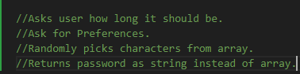

# Challenge-3-Making-Paswords

JavaScript based password generator

## Starting Thoughts/ Pseudo Code

As Time Went on This would have additional variables That i would have to consider. Such as, concatinating arrays based on preferences, as well as makeing a math function that would randomly choose based on length of the preference array.

## Description

I was able to apply JS logic into pre-existing code inorder to make a functional password Generator. For the most part all I added was the function that would actually determine preferences of desired passwords and write out a string to send back to get printed onto the page.

## Installation/ Deployed Page

https://github.com/B-R-Ls/Challenge-3-Making-Paswords
https://b-r-ls.github.io/Challenge-3-Making-Paswords/

## Usage

Has The full on Capability to create a random password based on selected prefercnes. 

## Credits

N/A

## License

MIT License